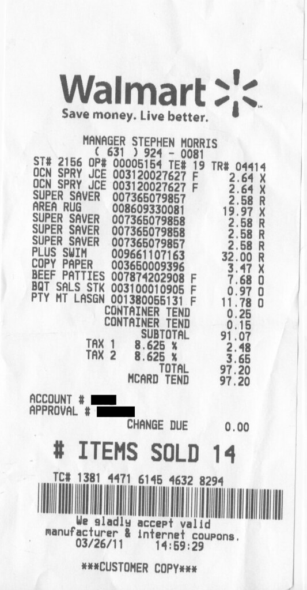

# ExpenseSave 💰

The **ExpenseSave** application will help the users to track their expenses and manage their personal finances.

### About the app :
A Full Stack Web Application built with MERN Stack.

The best part of this web application is that apart from the manually editing expenses there is an extra feature added wherein the user can upload the picture
of the receipt and the application will collect data from it.

Users can then visualize the data using pie charts in the front end.

### For setting up this project :

##### 1)Create a _config.env_ file inside the config folder.

##### 2)Add Required Environment Variables into this _config.env_ file as:

  MONGO_URI : Url to connect with MongoDB

  PORT : port to run the server

  clientID : Google Client Id for interacting with google oauth api

  clientSecret : Google secret for interacting with google oauth api

  cookieKey : Used to encrypt the cookies
  
  ##### Other Environment Variable:
  
  (OCRSPACE API KEY must be configured in the frontend)
  
  apikey : Used for interacting with the [OCRSpace API](http://ocr.space/OCRAPI)

##### 3) Installing dependencies:
```
npm install
```
##### Running both server and frontend concurrently:
```
npm run dev
```
##### Running the server:
```
npm run server
```
##### Running the frontend:
```
npm run frontend
```

### In Action 🤩
.gif)


The receipt that i have uploaded in the above video is -


